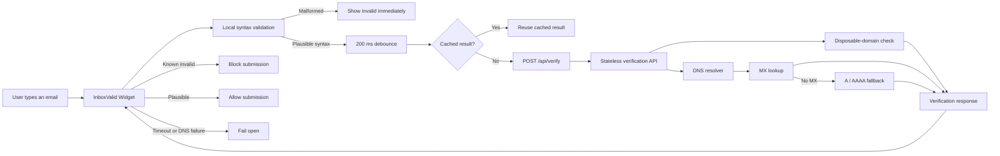
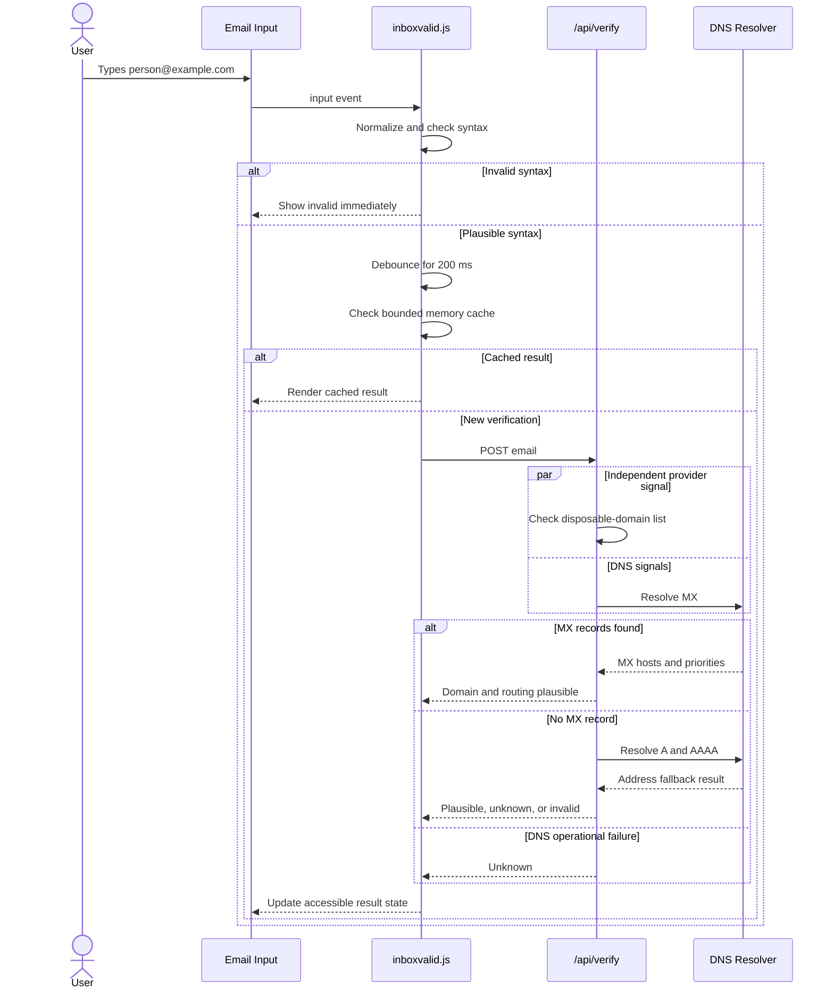
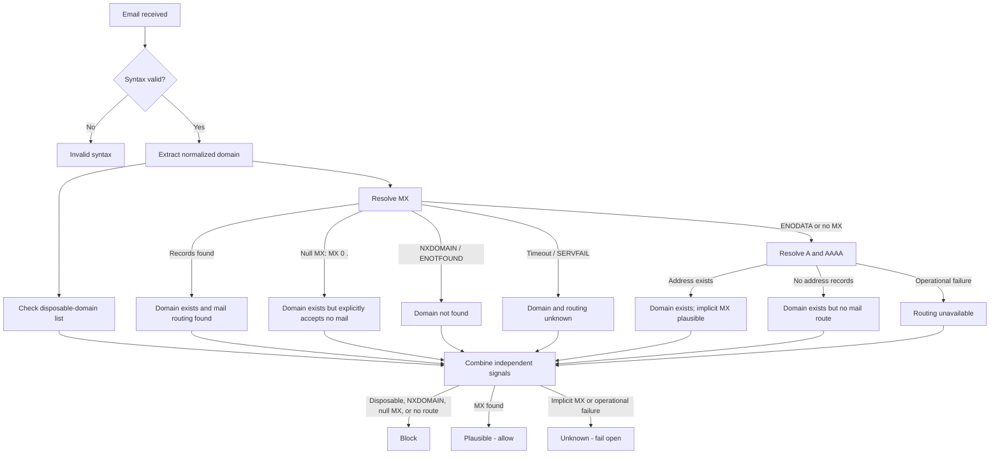
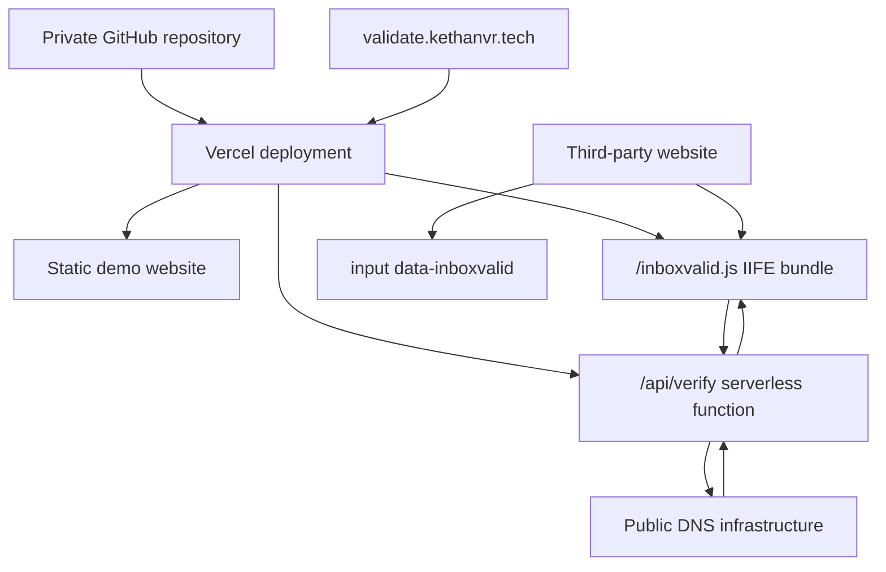

# InboxValid Real-Time Validation Widget

A zero-runtime-dependency email-validation widget that enhances existing signup and contact forms with immediate syntax feedback, disposable-domain detection, and real DNS/MX mail-routing checks.

### Project endpoints

- **Demo:** [validate.kethanvr.tech](https://validate.kethanvr.tech)
- **Widget bundle:** [validate.kethanvr.tech/inboxvalid.js](https://validate.kethanvr.tech/inboxvalid.js)

<a href="public/Screenshot%20from%202026-08-12%2015-41-34.png">
  
</a>

## Product walkthrough

The public demo exposes the real widget lifecycle, edge states, integration contract, and prototype boundaries. Select any screenshot to open the full-resolution image.

| Live validation                                                     | Validation pipeline                                                 |
| ------------------------------------------------------------------- | ------------------------------------------------------------------- |
| <a href="public/Screenshot%20from%202026-08-12%2015-53-26.png"></a> | <a href="public/Screenshot%20from%202026-08-12%2015-53-33.png"></a> |
| **Six explicit states**                                       | **One-attribute integration**                                 |
| <a href="public/Screenshot%20from%202026-08-12%2015-53-50.png"></a> | <a href="public/Screenshot%20from%202026-08-12%2015-53-56.png"></a> |

<a href="public/Screenshot from 2026-08-12 15-53-26.png"> </a>

The final view makes the product boundary explicit: the prototype validates syntax, domain existence, provider type, and DNS mail routing, but does not claim that an individual mailbox exists.

### Tech stack

TypeScript · Vanilla DOM · Vite · Node.js · Vercel Functions · DNS · Vitest

## Architecture Overview



## Run locally

Requirements: Node.js 20 or newer and npm.

```bash
npm install
npm run dev
```

Open the URL printed by Vite (normally `http://localhost:5173`). The development server exposes the demo and a local `/api/verify` route that performs real DNS lookups.

Useful checks:

```bash
npm run typecheck
npm run lint
npm test
npm run build
```

The production build creates the demo site and the standalone widget:

```text
dist/
├── index.html
├── assets/...
└── inboxvalid.js
```

## Embed the widget

Add `data-inboxvalid` to an email input and load the IIFE bundle:

```html
<form>
  <label for="email">Work email</label>
  <input id="email" name="email" type="email" data-inboxvalid required>
  <button type="submit">Create account</button>
</form>

<script
  src="https://validate.kethanvr.tech/inboxvalid.js"
  defer>
</script>
```

The widget derives `https://validate.kethanvr.tech/api/verify` from its own script URL. An explicit endpoint can be supplied when the API is hosted elsewhere:

```html
<script
  src="https://validate.kethanvr.tech/inboxvalid.js"
  data-endpoint="https://api.example.com/email/verify"
  data-debounce="200"
  data-timeout="2500"
  defer>
</script>
```

The same values can be configured per input:

```html
<input
  type="email"
  data-inboxvalid
  data-endpoint="https://api.example.com/email/verify"
  data-debounce="200"
  data-timeout="2500"
  data-cache-ttl="300000">
```

Or through the public JavaScript API:

```js
window.InboxValid.init({
  endpoint: "https://api.example.com/email/verify",
  debounceMs: 200,
  timeoutMs: 2500,
  cacheTtlMs: 300000,
});

const instance = window.InboxValid.attach(document.querySelector("#email"));
```

Configuration precedence is JavaScript options, input data attributes, loader-script data attributes, the loader script's origin, and finally the current page origin.

## Browser behavior

- Syntax feedback is immediate and never calls the API for malformed input.
- Remote checks start after a 200 ms debounce by default.
- New input aborts the previous request and stale responses are ignored.
- Completed responses are cached in a bounded, five-minute in-memory cache.
- Known invalid and disposable results block native form submission.
- A submission made while checking waits for the active request. The widget safely resumes it with `requestSubmit()` when the outcome permits it.
- Client timeout, network failure, DNS failure, and plausible A/AAAA fallback resolve to `unknown`, clear native validity, and fail open.
- Status is announced through an ARIA live region and is not communicated by color alone.

## Validation Sequence



### Options

| JavaScript     | Data attribute     |                      Default |           Accepted range |
| -------------- | ------------------ | ---------------------------: | -----------------------: |
| `endpoint`   | `data-endpoint`  | Script-origin`/api/verify` | Absolute or relative URL |
| `debounceMs` | `data-debounce`  |                      `200` |              0–5,000 ms |
| `timeoutMs`  | `data-timeout`   |                    `2,500` |           100–30,000 ms |
| `cacheTtlMs` | `data-cache-ttl` |                  `300,000` |         0–86,400,000 ms |

## Verification API

`POST /api/verify`

```json
{
  "email": "person@example.com"
}
```

Example response:

```json
{
  "email": "person@example.com",
  "domain": "example.com",
  "status": "valid",
  "sub_status": null,
  "domain_status": "exists",
  "mx_found": true,
  "mx_host": "mx.example.com",
  "fallback_address_found": null,
  "is_disposable": false,
  "verified_at": "2026-08-12T08:00:00.000Z"
}
```

Possible `status` values are `valid`, `invalid`, `disposable`, and `unknown`. Possible non-null `sub_status` values are:

The API retains `status: "valid"` as a transport-level compatibility value, but the widget presents it as **Plausible**. It means syntax, domain, provider, and mail-routing checks passed; it never claims that the individual mailbox exists. Every successful result explicitly shows “Mailbox existence not checked in this prototype.”

`domain_status` is an independent DNS signal:

| Domain status | Meaning                                                        |
| ------------- | -------------------------------------------------------------- |
| `exists`    | DNS confirmed the name, even if it has no mail-routing records |
| `not_found` | DNS returned NXDOMAIN /`ENOTFOUND`                           |
| `unknown`   | A timeout or operational DNS failure prevented confirmation    |

| Sub-status            | Meaning                                             | Form decision |
| --------------------- | --------------------------------------------------- | ------------- |
| `invalid_syntax`    | Address structure is malformed                      | Block         |
| `disposable_domain` | Known throwaway provider                            | Block         |
| `null_mx`           | Domain explicitly declares that it accepts no email | Block         |
| `no_mail_server`    | No MX, A, or AAAA route exists                      | Block         |
| `implicit_mx`       | No MX, but an A/AAAA fallback exists                | Allow         |
| `dns_unavailable`   | DNS timed out or failed operationally               | Allow         |

The endpoint supports credential-free CORS for third-party embedding. Validation outcomes use HTTP 200; malformed bodies use 400, and unsupported methods use 405.

The response intentionally follows InboxValid-style naming so a production endpoint can replace the prototype API with a small adapter rather than a widget rewrite.

## DNS & Mail Routing Decision Flow



### Decision summary

```text
MX query succeeds / ENODATA  -> domain exists
NXDOMAIN / ENOTFOUND         -> domain not found
DNS timeout or SERVFAIL      -> domain unknown / fail open
MX records found             -> mail routing valid
MX 0 . (null MX)             -> mail routing invalid
No MX + A or AAAA found      -> mail routing plausible / fail open
No MX, A, or AAAA            -> no mail routing
```

Domain existence and mail capability are reported separately. An existing DNS name can intentionally have no mail service, and an address-record fallback only establishes routing plausibility. Neither signal proves that the individual mailbox exists.

## Technical limits

This prototype implements syntax checking, DNS domain-existence classification, a small auditable disposable-domain dataset, typo suggestions, MX lookup, null MX detection, and A/AAAA fallback. It deliberately does **not** perform WHOIS/RDAP registration checks, SMTP mailbox probing, catch-all detection, mailbox-level deliverability, production risk scoring, or private InboxValid API calls.

The disposable dataset is illustrative rather than exhaustive. A production version should use a maintained provider feed or the production InboxValid service. No signup data is stored, and the demo is marked `noindex,nofollow`.

## Project structure

```text
api/
  _lib/verify-email.ts  DNS and disposable verification
  verify.ts             Vercel HTTP function
src/
  shared/               Shared response types and email helpers
  widget/               Embeddable library, cache, UI, and API client
  main.ts               Demo interactions
  style.css             Demo website design
tests/                  Unit and DOM integration tests
```

## Architecture decisions and trade-offs

The design optimizes for a small embeddable product, predictable failure behavior, and independently replaceable pipeline stages. It deliberately avoids infrastructure that does not improve the domain-level validation goal.

| Decision                                            | Optimized for                                                                                                     | Deliberate trade-off                                                                                  |
| --------------------------------------------------- | ----------------------------------------------------------------------------------------------------------------- | ----------------------------------------------------------------------------------------------------- |
| Vanilla TypeScript IIFE widget                      | Works in existing forms without requiring React, a framework runtime, or a build step                             | UI is implemented with direct DOM APIs rather than framework components                               |
| Immediate browser syntax validation                 | Fast perceived response and fewer unnecessary API calls                                                           | The server repeats syntax validation because client input cannot be trusted                           |
| One stateless Vercel function                       | Low-cost deployment, horizontal scaling, and no server lifecycle to manage                                        | No shared server-side cache in this prototype                                                         |
| No database or authentication layer                 | Minimal infrastructure, no stored signup data, and fewer privacy concerns                                         | No account history or analytics; there are no persistent entities that require an ER model            |
| Node DNS APIs behind an injected resolver interface | No paid dependency and deterministic unit testing; the resolver can be replaced without changing response mapping | DNS establishes domain and routing plausibility, not mailbox existence                                |
| Local disposable-domain module                      | Transparent, fast, and independently replaceable                                                                  | The bundled list is illustrative rather than exhaustive                                               |
| Bounded five-minute browser cache                   | Removes repeat checks without a database and prevents unbounded memory growth                                     | Cache is per page session and is not shared across users                                              |
| `AbortController`, request versions, and debounce | Prevents stale responses and excess requests during typing                                                        | Adds a small amount of client state-management code                                                   |
| 2.5-second fail-open timeout                        | A verification outage cannot break the host website's signup path                                                 | Some uncertain addresses are intentionally allowed                                                    |
| Credential-free CORS                                | The script works when embedded on a different origin                                                              | A production public endpoint needs rate limiting, monitoring, and an abuse-control policy             |
| InboxValid-style response fields                    | A production verifier can be introduced through an adapter instead of a widget rewrite                            | `status: "valid"` remains in the transport contract while the UI correctly says **Plausible** |

### Why the pipeline is modular

Each responsibility has a narrow boundary:

```text
email parsing + suggestions
        ↓
widget state + form integration
        ↓
HTTP client + timeout/cancellation
        ↓
verification response contract
        ↓
disposable provider check + DNS resolver
```

- Email parsing, the disposable dataset, cache, HTTP client, UI controller, shared contract, and DNS verification live in separate modules.
- The widget consumes `VerificationResponse` rather than DNS implementation details.
- The DNS verifier accepts a `DnsResolver`, so tests use deterministic fakes and a future managed DNS service can be substituted without changing business rules.
- Endpoint discovery and explicit configuration allow the widget and API to be deployed together or independently.

### Scaling characteristics

The API is stateless and performs no database writes, so multiple instances can handle requests without coordination. Browser debounce, cancellation, and caching reduce avoidable traffic before it reaches the API. The current design is appropriate for a low-cost demonstration and can grow without changing the widget contract.

At larger volume, preserve the existing interfaces and add:

1. Rate limiting and abuse monitoring at the public API boundary.
2. A shared TTL-aware DNS result cache and in-flight request coalescing by domain.
3. A maintained disposable-provider feed behind the existing module interface.
4. Metrics for latency, timeout rate, DNS outcomes, and fail-open frequency.
5. A production verification adapter for SMTP, catch-all, and risk signals when reliable infrastructure is available.

## Assumptions

- A **Plausible** result is domain-level evidence only; mailbox existence is not checked in this prototype.
- `ENODATA` means the DNS name exists but lacks the requested record type; only NXDOMAIN / `ENOTFOUND` is classified as `not_found`.
- Temporary DNS and network failures must not block a legitimate signup.
- A domain with no MX may still use the standards-defined A/AAAA fallback, which is reported as plausible rather than fully confirmed.
- The demo stores no submitted form data and does not require authentication or a database.

## Verification coverage

The automated suite covers parsing, normalization, typo suggestions, cache expiry and eviction, configuration precedence, debounce, cancellation, stale responses, submission resumption, timeout/fail-open behavior, accessible status output, CORS, malformed requests, and DNS cases including MX priority, null MX, ENODATA, NXDOMAIN, A/AAAA fallback, SERVFAIL, and timeout.

The production build is also checked as a standalone IIFE from a separate local origin to verify that script-origin endpoint discovery and cross-origin API requests work outside the demo page.

## Deployment Architecture



The deployment contains three separate deliverables: the demonstration website, the embeddable JavaScript library, and the stateless verification API. The host website does not need to share the demo's origin.

## Deploy to Vercel

1. Import this private repository into Vercel.
2. Keep the detected Vite settings; `vercel.json` runs `npm run build` and publishes `dist`.
3. Confirm the demo, `/inboxvalid.js`, and `/api/verify` on the generated Vercel URL.
4. Add `validate.kethanvr.tech` in the project's Domains settings.
5. Add the DNS record Vercel supplies, then repeat the three route checks on the custom domain.

Deployment, DNS modification, GitHub pushing, and reviewer access are intentionally not automated here. A private repository URL alone does not grant access; invite the reviewer using the GitHub identity supplied by HR.
